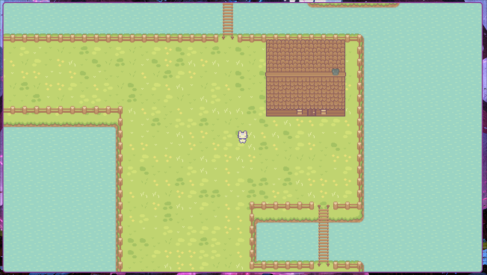

# 🌟 Stardgot: The Open Source Game

   
   

  
  

   
   

  
  
  

**Stardgot** is a charming open-source game built with [Godot Engine 4.4](https://godotengine.org/) using **C#**. The game features pixel-art visuals from the **[Sprout Lands Pack](#Credits)**.

> 🌱 Grow, explore, and build — Stardgot is designed to be modifiable, accessible, and fully open source.

---

## Features

- Developed in **C#** using **Godot 4.4 (Mono)**
- Pixel-art assets from the **Sprout Lands Pack**
- Modular architecture for easy content addition
- Fully open source and mod-friendly

---

## 🛠 Requirements

- [Godot 4.4 (Mono version)](https://godotengine.org/download)
- .NET SDK 8.0+

---

## Project Structure

- `assets/` : Art, music, sound, fonts, and pixel-art resources
  - `audio/` : Background music and sound effects
  - `fonts/` : Pixel fonts and previews
  - `gfx/` : Backgrounds, characters, tilesets, UI images
  - `imgs/` : Additional images and imports
- `build/` : Build output directory
- `scenes/` : Main game scenes (main map, menus, player, overlays)
  - `main/` : Core game scenes
  - `menus/` : Menu scenes (main menu, settings, pause)
  - `player/` : Player scene
- `scripts/` : C# scripts for game logic
  - `core/` : Core systems (e.g., navigation)
  - `main/` : Main game logic
  - `menus/` : Menu logic
  - `player/` : Player logic
- `shaders/` : Shader files and materials
- `project.godot` : Godot project configuration
- `Stardgot.csproj`, `Stardgot.sln` : C# project and solution files
- `README.md`, `LICENSE`, `icon.svg` : Documentation and project metadata

---

## How to Run

1. Open the project folder in **Godot 4.4 (Mono)**.
2. Make sure you have .NET SDK 8.0 installed.
3. Click **Play** in the Godot editor to start the game.

---

## 📦 Releases

You can download the latest builds and releases from our [GitHub Releases page](https://github.com/Times-Z/stardgot/releases).

---

## Documentation

> All documentation (included technical inside of the code) has been created with AI assistant help. Documentation is helpful but a pain to write

- [GameRoot / Viewport architecture](docs/architecture-gameroot.md)
- [Components guide](docs/components-guide.md)
- [Control system guide](docs/controls-system-guide.md)
- [Settings system](docs/settings-system-guide.md)

---

## Credits

### Assets

- **Sprout Lands Premium Pack** - By [Cup Nooble](https://cupnooble.itch.io/)
  - Character sprites, tilesets, objects, and UI elements
  - Licensed for commercial and non-commercial use
  - [Discord](https://discord.gg/PyDwcnPY) | [Twitter](https://twitter.com/Sprout_Lands)

- **Sprout Lands Premium UI Pack** - By [Cup Nooble](https://cupnooble.itch.io/)
  - UI sprites, emojis, and interface elements
  - Licensed for commercial and non-commercial use

> **License Terms**: Assets are used under the original licensing terms which allow modification, commercial use, and open source distribution with proper attribution. NFT and AI training usage is not permitted. Full license details can be found in the respective asset pack readme files.
